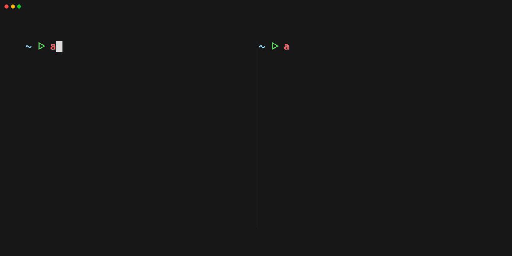

# Control Tags ⚡️

Scalable integrity framework for ABAC on AWS

> [!CAUTION]
> This project is in early development, exercise caution when using in production, and expect breaking changes.

## Features

* Centralized, hierarchical management of tagging integrity for Attribute-Based Access Control (ABAC) on AWS
* Multi-party approval
  * for sensitive actions (guarded actions)
  * for sensitive resources (resource seals)
* AWS SSO integration


## Demo



## Installation

### Prerequisites

#### AWS SSO-based setups

When using AWS Identity Center (AWS SSO), you will need

1. AWS organization with:
    1. ["all features"](https://docs.aws.amazon.com/organizations/latest/userguide/orgs_getting-started_concepts.html#feature-set-all) enabled
    2. Trusted access for [AWS Identity Center (SSO)](https://docs.aws.amazon.com/singlesignon/latest/userguide/getting-started.html) enabled
    3. Trusted access for [Stacksets](https://docs.aws.amazon.com/AWSCloudFormation/latest/UserGuide/stacksets-orgs-activate-trusted-access.html) enabled
    4. [SCP](https://docs.aws.amazon.com/organizations/latest/userguide/orgs_manage_policies_scps.html)s enabled
2. Two or more humans with "admin-ish" roles (SecOps/SRE/etc) in the organization.

#### Non AWS-SSO setups

in a non-SSO setup you'd typically have an external IdP (Okta, Jumpcloud) set up directly against an IAM Identy Provider in one or more accounts.

For this setup, you'll not be needing trust access for AWS SSO prerequisite, but you will be needing the following:

* pass an `aws:sourceIdentity` inside the SAML Assertion or OIDC claim.
* explicitly tag humans'IAM principals with the `tagctl:v1/meta/grant_path` tag, taking care that the value for the tag must be `tagctl:v1/admin` for the IAM principal to be able to set or unset multiparty approval tickets.

*note:* In a non-SSO setup you do not have need for mirror roles, as the IAM principals assumed by the IAM identity provider can be tagged.

### Dependencies

1. install [aws-cli](https://docs.aws.amazon.com/cli/latest/userguide/getting-started-install.html)
2. install [terraform](https://developer.hashicorp.com/terraform/install)
3. install [rust](https://www.rust-lang.org/tools/install)
4. install [cargo lambda](https://www.cargo-lambda.info/guide/installation.html)


### Build the CLI from source

run this make command to build the CLI from source

```sh
make build-cli
```

The output binary will be located at `./target/release/tagctl`

(Optional) Publish the binary to `/usr/local/bin` so it's in your path

```sh
make install-cli
```

### Build the Lambda function from source

```sh
make build-lambda
```

The output zip will be located at `./target/lambda/retention-lambda/bootstrap.zip`

### Terraform Deployment

1. Source the `terraform/control-tags` module in your terraform code
2. (Optional) Configure the `well_known_tag_keys` for the control tags SCP based on your organization's tagging policy.\
well-known tags can be applied together with the control tags in automated context like terraform, CI systems, etc.
2. Configure the `deployment_targets` for the control tags SCP.
3. When using AWS SSO (recommended), configure the `sso_mirror_spec` to create taggable roles with same permissions as the SSO permission sets.\
(This step is mandatory in order to enable multi-party approval via the `tagctl ticket set` command).\
**Caveat:** make sure there's at least one permissionset that has `grant_area_suffix = "admin"` - it is required in order to apply mulit-party approval,\
as the approval ticket is *currently* an admin-only feature.
4. Conigure the `lambda_archive_file` to point to the location of the `bootstrap.zip` archive.
5. (Optional) Configure the `guarded_action_spec` to define sensitive actions that require multi-party approval.


#### Example Usage
```terraform
module "control_tags" {
  source = "../../control-tags/terraform/control-tags"

  well_known_tag_keys = ["team", "env", "info/*"]

  deployment_targets = {
    organizational_unit_ids = [aws_organizations_organizational_unit.control_tags_goverened.id]
    account_ids             = []
  }

  sso_mirror_spec = {
    "${aws_ssoadmin_permission_set.admin.arn}" = {
      grant_area_suffix = "admin"
    }
    "${aws_ssoadmin_permission_set.admin_tagger.arn}" = {
      grant_area_suffix = "admin"
    }
  }
  emit_scp_sids = "long"

  lambda_archive_file = "../../control-tags/target/lambda/retention-lambda/bootstrap.zip"

  guarded_action_spec = {
    "s3" = {
      actions = ["s3:DeleteBucket"]
      deployment_targets = {
        organizational_unit_ids = [aws_organizations_organizational_unit.control_tags_goverened.id]
      }
    }
  }
}

```


### Usage

### Help
Display help for various commands

```sh
tagctl -h
```

### Display approval information

Get the ticket for the current AWS principal

```sh
tagctl ticket get
```

Set the ticket for the the named human identity `bob` on the the role named `myrole`

```sh
tagctl ticket get --role-name myrole
```

Get the ticket for the AWS principal whose credentials are obtained by profile `myprofile`

```sh
tagctl ticket get --profile myprofile
```

### Set approval

Set the ticket for the the named human identity `bob` on the current AWS principal

```sh
tagctl ticket set bob
```

Set the ticket for the the named human identity `bob` on the the role named `myrole`

```sh
tagctl ticket set bob --role-name myrole
```


Set the ticket for the the named human identity `bob` for the AWS principal whose credentials are obtained by profile `myprofile`

```sh
tagctl ticket set bob --profile myprofile
```


### Unset approval

*reminder*: unsetting a ticket manually is not mandatory, as the retention lambda will automatically unset the ticket after it has expired.


Unset the ticket on the current AWS principal

```sh
tagctl ticket unset
```

Unset the ticket on the the role named `myrole`

```sh
tagctl ticket unset --role-name myrole
```


Unset the ticket for the AWS principal whose credentials are obtained by profile `myprofile`

```sh
tagctl ticket unset --profile myprofile
```


### Assuming a mirror role

*note:* Assuming an sso mirror role is necessary for setting and unsetting a approval ticket,\
as SSO roles are managed directly by the AWS SSO service principal and as such cannot be tagged on untagged.


Produce temporary crednetials for the current AWS Principal

```sh
tagctl mirror assume
```

*note:* the `tagctl mirror assume` command will produce temporary credentials to stdout,\
to export them as env vars in the current shell, use a script like [this](https://stackoverflow.com/questions/65880727/bash-script-for-aws-assume-role)


### Testing
WIP
 😅
👉👈
